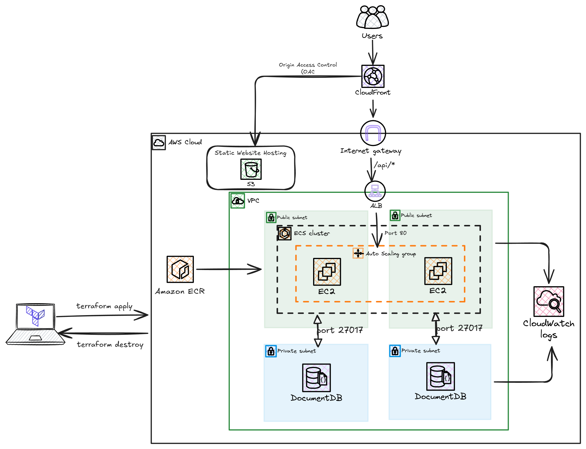

# How to Deploy a React and Go application on AWS ECS and S3 using Terraform

A production-grade, cloud infrastructure built with **Terraform**, hosting a **React Single Page Application ** on **Amazon S3 & CloudFront**, containerized **Go REST API** on **Amazon ECS (EC2)**, and a private **Amazon DocumentDB (MongoDB-compatible)** cluster.



---

## 1. Project Overview & Business Problem

Deploying full-stack applications to the cloud often forces developers into common operational traps: exposing databases directly to the internet, fighting Cross-Origin Resource Sharing (CORS) preflights, managing multiple SSL certificates across subdomains, and running bloated container images.

This project provisions an enterprise-grade cloud architecture on AWS using **Infrastructure as Code (Terraform)** to deploy a stateful to-do management application with end-to-end security, and high availability across two Availability Zones.

---

## 2. Architecture & Design Decisions

The architecture follows a strict three-tier layout separated by network boundaries:

```
[ User Browser ]
       │ (HTTPS)
       ▼
[ Amazon CloudFront (CDN) ] ─── (Reverse Proxy)
       │
       ├───► [ Amazon S3 (Private Bucket) ] (React SPA via Origin Access Control)
       │
       └───► [ Application Load Balancer (ALB) ] (Port 80)
                   │
                   ▼
             [ Amazon ECS on EC2 ] (Auto Scaling Group across us-east-1a & 1b)
                   ├── Pulls images from Amazon ECR
                   ├── Streams logs to Amazon CloudWatch (/ecs/go-todo-api)
                   │
                   ▼ (TLS Port 27017)
             [ Amazon DocumentDB ] (Private Database Subnet Group)
```

### Key Architectural Decisions:

| Layer | Technology | Key Architectural Rationale |
| :--- | :--- | :--- |
| **Edge Router** | **Amazon CloudFront** | Acts as a **smart reverse proxy** routing static assets (`/*`) to S3 and dynamic API calls (`/api/*`) to the ALB. Eliminates CORS preflight overhead and serves the entire app over a single HTTPS domain. |
| **Static Storage** | **Amazon S3 + OAC** | S3 bucket is 100% private. Access is restricted strictly to CloudFront via **Origin Access Control (OAC)** with SigV4 signing. |
| **SPA Routing** | **CloudFront Error Responses** | Maps `403` and `404` errors back to `/index.html` with HTTP 200, allowing React Router to handle client-side page refreshes without breaking. |
| **Compute** | **Amazon ECS on EC2** | Runs containerized Go tasks in `awsvpc` network mode across an Auto-Scaling Group (2 `t3.micro` instances) in multiple AZs for fault tolerance. |
| **Database Tier** | **Amazon DocumentDB** | Fully managed MongoDB-compatible cluster isolated in private subnets. Port `27017` accepts traffic **only** from the ECS Security Group. |
| **Containerization** | **Multi-Stage Docker** | Compiles statically linked Go binaries (`CGO_ENABLED=0`), reducing image size by **97% (from 850MB to 15MB)**. |

---

## 3. Constraints & Tradeoffs 
### Constraint 1: Zero Public Database Exposure
* **Requirement**: DocumentDB contains stateful application data and must never be exposed to the internet.
* **The Decision**: Created an isolated `aws_docdb_subnet_group` and bounded ingress port `27017` strictly to `aws_security_group.ecs-sg`.

### Constraint 2: Single-Domain & Mixed Content Prevention
* **Requirement**: Browsers block insecure HTTP API calls originating from HTTPS web pages (Mixed Content blocking).
* **The Decision**: Unified the S3 frontend and ALB backend under one CloudFront distribution. The React frontend calls `BASE_URL = "/api"` with zero hardcoded backend endpoints.

---

## 4. Estimated Cost & Monthly Pricing Incurred

The entire infrastructure runs on cost-conscious AWS primitives suitable for development, staging, or light production workloads.

| Service | Configuration | Estimated Monthly Cost (USD) |
| :--- | :--- | :--- |
| **Amazon DocumentDB** | 1x `db.t3.medium` instance [Free Tier eligible](https://aws.amazon.com/documentdb/pricing/#:~:text=Free%20trial,on%2Ddemand%20rates.) |
| **Amazon EC2 (ECS Nodes)** | 2x `t3.micro` instances (in Auto Scaling Group) | ~$15.00 / month *(Free Tier eligible)* |
| **Application Load Balancer** | 1x ALB (~0.5 LCU) | ~$16.85 / month |
| **Amazon CloudFront** | Free Tier: 1TB data transfer out + 10M requests | $0.00 |
| **Amazon S3** | < 1 GB storage + GET requests | < $0.00 / month |
| **Amazon ECR & CloudWatch** | 7-day log retention + Docker image storage | < $1.00 / month |
| **Total Estimated Cost** | | **~$32.85 / month** *(~$1.00 / day)* |

> 💡 **Cost Optimization Tip**: DocumentDB instance `db.t3.medium` represents ~65% of the total cost. For temporary demos or portfolio reviews, destroy the infrastructure with `terraform destroy` when not in use.

---

## 5. Project Setup & Deployment Guide

### Prerequisites
* [AWS CLI](https://aws.amazon.com/cli/) configured (`aws configure`)
* [Terraform](https://learn.hashicorp.com/tutorials/terraform/install-cli) v1.5+
* [Docker](https://docs.docker.com/get-docker/) installed locally
* [Node.js](https://nodejs.org/) & npm

---

### Step 1: Clone the Repository
```bash
git clone https://github.com/achenchi7/react-go-app.git
cd react-go-app
```

---

### Step 2: Build the React Frontend
```bash
cd client
npm install
npm run build
cd ..
```

---

### Step 3: Build & Push the Docker Image to ECR
```bash
# 1. Login to Amazon Public ECR (or Private ECR)
aws ecr-public get-login-password --region us-east-1 | docker login --username AWS --password-stdin public.ecr.aws

# 2. Build the optimized multi-stage image
docker build -t go-todo-api:v2 .

# 3. Tag and push
docker tag go-todo-api:v2 public.ecr.aws/x5g4c0f9/playground:v2
docker push public.ecr.aws/x5g4c0f9/playground:v2
```

---

### Step 4: Provision Cloud Infrastructure with Terraform
```bash
cd infra
terraform init
terraform plan
terraform apply
```

---

### Step 5: Upload Frontend Assets to S3
Once Terraform completes, note the `s3_bucket_name` and `cloudfront_domain_name` from the outputs:

```bash
# Sync compiled assets to the private S3 bucket
aws s3 sync ../client/dist/ s3://<s3_bucket_name>/ --delete
```

Open your CloudFront URL (`https://<cloudfront_domain_name>`) in your browser to access the live application!

---

## 6. Teardown (Clean Up Resources)

To avoid incurring ongoing AWS charges:

```bash
# 1. Empty the S3 bucket first
aws s3 rm s3://<s3_bucket_name> --recursive

# 2. Destroy all infrastructure
cd infra
terraform destroy
```
